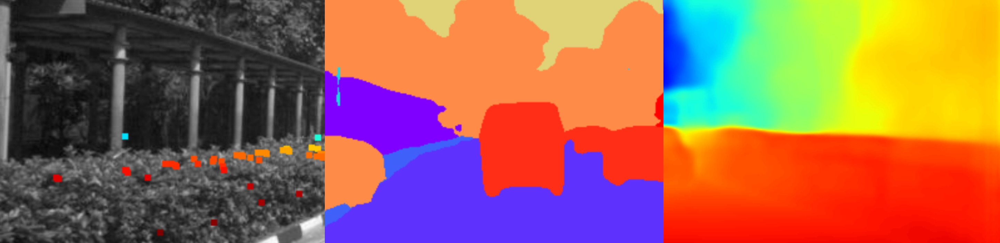
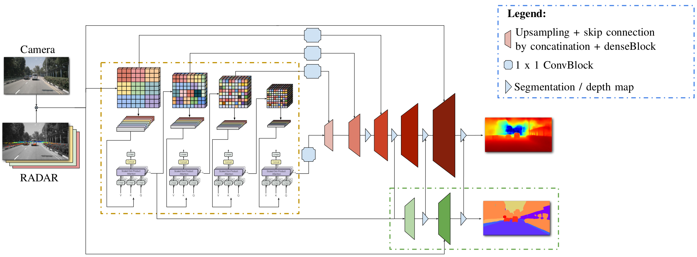

# CamRaDepth: Semantic Guided Depth Estimation Using Monocular Camera and Sparse Radar

[](https://www.linux.org/)
[](https://www.python.org/downloads/release/python-390/)
[](https://www.docker.com/)

<div align=center></div>

<details closed>
<summary> <h2> 📰 Abstract </h2> </summary>
Our research aims to generate robust and dense 3D depth maps for robotics and autonomous driving applications.
Since cameras output 2D images and active sensors such as LiDAR or radar produce sparse depth measurements, dense depth maps need to be estimated.
Recent methods based on visual transformer networks have outperformed conventional deep learning approaches in various computer vision tasks including depth prediction but have focused on the use of a single camera image.
This paper explores the potential of visual transformers applied to the fusion of monocular images, semantic segmentation, and projected sparse radar reflections for robust monocular depth estimation. The addition of a semantic segmentation branch is used to add object-level understanding and is investigated in a supervised and unsupervised manner.
We evaluate our new depth estimation approach on the \textit{NuScenes} dataset where it outperforms existing state-of-the-art camera-radar depth estimation methods.
We show that even without running segmentation at inference, models can benefit from an additional segmentation branch during the training process by transfer learning.
</details>

<details>
<summary> <h2> 📁 Folder Structure </h2> </summary>

* `CamRaDepth`: Contains the model's scripts: Running pipeline, the PyTorch model, relevant arguments, utilty functions, etc.
   * `data`: Contains dataloader.py and the datasplit file, that contains the files name in order of train (0:17901) / validation (17902: 20138) / test (20139: 22375).
   * `models`: 
        * `CamRaDepth.py`:  PyTorch Model. It is a generic implemetation for all the various architectures we present.
        * `diffGradNorm.py`: A novel  optimizer: [diffGradNorm](https://github.com/shivram1987/AdaNorm)
        * `simplfied_attention.py`:  The backbone for the visual transformer from: [Simplified Transformer](https://github.com/NVIDIA/DL4AGX/tree/5fac5c5a20f6bbe770c938dd05c7b0675b373934/DEST)
   * `visualization`: Contains different scripts to plot or visualize data

* `lib`: Contains utility functions from [RC-PDA](https://github.com/longyunf/rc-pda) to fuse lidar or radar pointclouds
* `scripts`: Contains slightly modified python scripts from [RC-PDA](https://github.com/longyunf/rc-pda) to prepare input data and generate ground truth depth maps

</details>

<details>
<summary> <h2> 🐋 Docker Setup </h2> </summary>

We suggest using Docker to avoid compatibility problems.
1. Go to the root directory of this repositors.
  ```bash 
  cd CamRaDepth/
  ```
2. Build the Docker image.
  ```bash 
  docker build -t camradepth . 
  ```
3. Run the container and mount the repository and the data.
  ```bash
  cd ..
  ./run_docker.sh
  ```

</details>

<details>
<summary> <h2> 📑 Preparation </h2> </summary>

### 1. Set Up External Repos
Clone [RAFT](https://github.com/princeton-vl/RAFT.git) to `external/` <br/>
and run `cd external/RAFT && ./download_models.sh`

Clone [Panoptic-DeepLab](https://github.com/bowenc0221/panoptic-deeplab) to `external/` <br/>

We use the data preprocessing pipeline from [RC-PDA](https://github.com/longyunf/rc-pda)

 ### 2. Installation of relevant requirements.
 This project doesn't require any special installation or version specific packages. 
 One could simply create a new ["Conda"](https://www.anaconda.com/products/distribution) enviroment and install the provided requirements.txt file:

   ```bash 
  conda create -n <name_of_environment> python=3.9
  ```
and then:

  ```bash 
  pip install -r requirements.txt 
  ```
 **Note**: This project was run solely on Linux, and was not tested on Windows or Mac.

### 3. Download Data
Download the [nuScenes](https://www.nuscenes.org/nuscenes#download) dataset, and put it outside - next to this CamRaDepth repository.
**Note**: For quick setup, the scripts are currently using the nuScenes Mini dataset. Change the pathes in the following script to run the full nuScenes dataset.

**Note**: If you desire to download the dataset through the terminal, please follow the discussion found [here](https://github.com/nutonomy/nuscenes-devkit/issues/110). Follow the steps, including the renaming part. Then, unzip the folder using:

```bash
tar -zxvf v1.0-mini.tgz -C nuscenes_mini
```

### 4. Data Preparation
**Run all data preparation scripts:** <br/>
Adjust `DATA_DIR` and `DATA_VERSION` in [precprocess_data.sh](scripts/preprocess_data.sh)
```bash
./scripts/preprocess_data.sh
```

**Hint:** The external repos are using deprecated functions, and might cause an error. Replacing `torchvision.models.utils` by `from torch.hub import load_state_dict_from_url` can fix them.<br/>
Files:<br/>
 `external/panoptic-deeplab/segmentation/model/backbone/hrnet.py`<br/>
 `external/panoptic-deeplab/segmentation/model/backbone/mnasnet.py`<br/>
 `external/panoptic-deeplab/segmentation/model/backbone/mobilenet.py`<br/>
 `external/panoptic-deeplab/segmentation/model/backbone/resnet.py`<br/>
 `external/panoptic-deeplab/segmentation/model/backbone/xception.py`


### 5. Generate Quasi-Ground-Truth Semantic Segmentation
Use `external/mseg-semantic` from [mseg](https://github.com/mseg-dataset/mseg-semantic) to generate semantic labels for the image:
```bash
mkdir external/mseg && cd external/mseg/
# Download weights
wget --no-check-certificate -O "mseg-3m.pth" "https://github.com/mseg-dataset/mseg-semantic/releases/download/v0.1/mseg-3m-1080p.pth"
# Install mseg-api
git clone https://github.com/mseg-dataset/mseg-api.git
cd mseg-api && sed -i '12s/.*/MSEG_DST_DIR="\/dummy\/path"/' mseg/utils/dataset_config.py
pip install -e .
cd ..
# Install mseg-semantic
git clone https://github.com/mseg-dataset/mseg-semantic.git
cd mseg-semantic && pip install -r requirements.txt
pip install -e .
cd ..
```
  
**Note**: We now assume that the current working directory is `CamRaDepth/externals/mseg-semantic`
  
change line 23 of file 'mseg-semantic/mseg_semantic/utils/img_path_utils.py' to:

```bash
suffix_fpaths = glob.glob(f"{jpg_dir}/*_im.{suffix}")
```

Run inference with the correct data source directory
```bash
CONFIG_PATH="mseg_semantic/config/test/default_config_360_ms.yaml"

python -u mseg_semantic/tool/universal_demo.py \
  --config="$CONFIG_PATH" \
  model_name mseg-3m \
  model_path mseg-3m.pth input_file ../../../nuscenes_mini/prepared_data/
```

Change and combine the labels for the right format
```bash
python scripts/vehicle_seg.py
```

</details>

<details>
<summary> <h2> 📥 Download Pretrained Weights </h2> </summary>

Download pretrained weights (from Google Drive, we suggest using gdown):  
(link: https://drive.google.com/file/d/1H60SUhrirkkIK9kf0qBhbg_Ut0Cr5n7X/view?usp=drive_link)
```bash
pip install gdown
mkdir src/checkpoints && cd src/checkpoints
gdown 1H60SUhrirkkIK9kf0qBhbg_Ut0Cr5n7X
unzip checkpoints.zip -d ..
```
**Note 1**: "FS" - From scratch, "TL" - Transfer learning scheme. <br> 
**Note 2**: It is assumed that the code is run from the main directory, CamRaDepth

</details>

<details>
<summary> <h2> 🖥 Run the Code </h2> </summary>

 ### Modes and Expected Outputs:
 Pass the argument `run_mode`:
  * `train`: if `save_model` is set to True, the model will save intermediate checkpoints and Tensorsboard files, to a folder that is specified as `output_dir/arch_name/run_name`. For example: "outputs/CamRaDepth/Base_batchsize_4_run1". Multiple runs could be done to the same folder. The checkpoints are saved according to the best perfromance so far over the validation set, and in thier name specify the val-loss value, for reference.
  Note that each ckpt file would weigh ~350 MB.

  * `test`: Would not save anything to the disk, but only print a summary of the model's performance on the test set, stating measurments such as RMSE for 50m and 100m, MAE, runtime, performance only on edge cases, etc.

<details>
<summary> <h3> Arguments <h3> </summary>

* There are two ways to pass arguments to the model:
  * `conventual`: Use the common method of passing the different arguments through the command line.
  * `manually` (recommended): Under utils/args.py you will find the "Manual settings" section. Uncomment this section, and set your desired values as you wish, much more comfortably.

* Needed arguments for `training`:
  * `save model`: defines if checkpoints and tensorboard files should be saved to disk.
  * `load_ckpt`: A boolean value that defines if a checkpoint should be loaded from disk.
  * `distributed`: A boolean value that defines if the model should be trained in a distributed manner (torch.nn.DataParallel()).
  * `run_mode`: A string our of ["train", "test"], that defines if the model should be trained or tested.
  * `model`: A string out of ["base (rgb)", "base", "supervised_seg", "unsupervised_seg", "sup_unsup_seg", "sup_unsup_seg (rgb)"].
  * `checkpoint`: Should be set if transfer learning is desired. The abs-path to the checkpoint that should be stated.
  * `arch_name`: A string that helps to disntiguish between running modes (e.g. "Debug", "Transformer", etc.)
  * `run_name`: A specific name for a specific run (e.g. "Base_batchsize_6_run_1").
  * `batch_size`: The batch size.
  * `desired_batch_size`: Hardware could be quite limiting, therefore you can set this parameter for "gradients accumelations", meaning that the backprop pipeline will be exceuted every `update_interval` = `desired_batch_size` / `batch_size` iterations.
  * `div_factor`: Is the div_factor argument for the OneCycleOptimzer by PyTorch.
  * `learning_rate`: The learning rate.
  * `cuda_id`: If using cude, and there is more than one GPU in the system. The default --> 0.
  * `num_steps`: Instead of the setting a fixed number of epochs, set the number of running update steps. (Takes the `update_interval` into account).
  * `num_epochs`: If running as specific number of epochs is desired.
  * `rgb_only`: Set the number of input channels to 3.
  * `input_channels`: Number of input channels (default --> 7).
  * `early_stopping_thresh`: The threshold for the early stopping mechanism.

</details>

### Training Example Command
**Note:** Training does only make sence with the full dataset as the mini does not provide enough data for meaningful training.

```bash
python src/main/runner.py --run_mode train --model base --save_model --batch_size 2 --desired_batch_size 6 --num_steps 60000 --run_name 'base_batch(2-6)' --split <created_split_for_the_full_dataset.npy>
```

### Evaluation (inference) Example Command
**With Full nuScenes Dataset:**
```bash
python src/main/runner.py --run_mode test --checkpoint checkpoints/Base_TL.pth --model base
```
**With nuScenes Mini:**
```bash
python src/main/runner.py --run_mode test --checkpoint checkpoints/Base_TL.pth --model base --split <your_mini_split_path> --mini_dataset
```

**Note:** the `mini_dataset` argument is a must for the mini split, as the dataloader will take the entire split is a test set.
The default split file argument (<your_mini_split_path>) is `new_split.npy`

* Needed arguments for `testing` (inference) - look above for a more detailed description:
  * run_mode
  * checkpoint
  * model
  * cuda_id

</details>

<details>
<summary> <h2> 🗺 Visualization </h2> </summary>

```bash
python visualization/visualization.py --vis_num 10
```
This module will create and save to the disk a variety of inputs, such as the depth map, RADAR and LiDAR projection onto the image place, transperent depth projection, semantic segmenation, etc for each one of the input instances of the given dataset (for `vis_num` different inputs). One could easily view the different visualizations under `output_dir/visualizations/collage` as a single collage, or go to the corresponding directory with the specific instance name, that one would like to examine.

</details>

<!-- ## Our results -->

<details>
<summary> <h2> 🧮 Model Architecture </h2> </summary>

<div align=center></div>

</details>

<details>
<summary> <h2> 📇 Contact Info </h2> </summary>

Dan Halperin,
dan.halperin@tum.de,
Institute of Automotive Technology,
School of Engineering and Design,
Technical University of Munich,
85748 Garching,
Germany

Florian Sauerbeck,
florian.sauerbeck@tum.de,
Institute of Automotive Technology,
School of Engineering and Design,
Technical University of Munich,
85748 Garching,
Germany

</details>

<details>
<summary> <h2> 📃 Reference </h2> </summary>

``` bib
@ARTICLE{sauerbeck2023camradepth,
  author={Sauerbeck, Florian and Halperin, Dan and Connert, Lukas and Betz, Johannes},
  journal={IEEE Sensors Journal}, 
  title={CamRaDepth: Semantic Guided Depth Estimation Using Monocular Camera and Sparse Radar for Automotive Perception}, 
  year={2023},
  volume={},
  number={},
  pages={},
  doi={10.1109/JSEN.2023.3321886}
}
```

</details>
