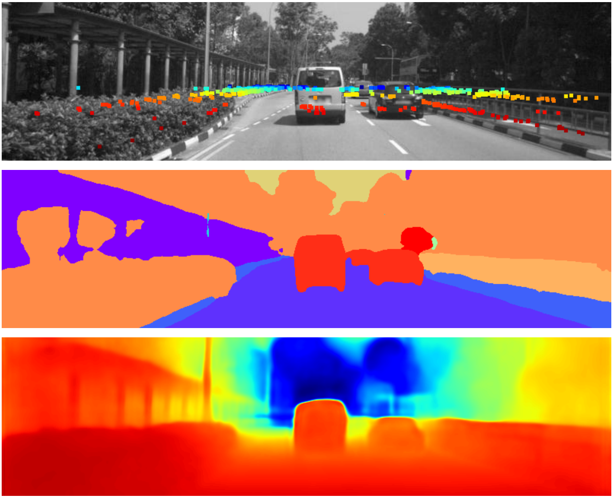

# CamRaDepth: Robust Segmentation Supported Depth Completion of Camera and RADAR Data Using Transformers

## The corresponding code and instructions will be published here soon! Stay tuned!

<div align=center></div>

<!-- ``` bib
@inproceedings{sauerbeck2022camradepth,
  title={CamRaDepth: Robust Segmentation Supported Depth Completion of Camera and RADAR Data Using Transformers},
  author={Sauerbeck, Florian and Halperin, Dan and Connert, Lukas and Betz, Johannes},
  booktitle={UNDER REVIEW},
  year={2023}
}
``` -->
